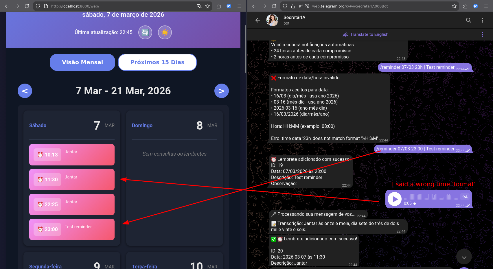

# Kalendario

A complete **multi-user** system for managing doctor appointments with a Telegram bot for adding appointments and a static web application for displaying them on phones.



## 🌟 Key Features

✨ **Multi-User Support** - Each Telegram user has their own private appointments  
🔒 **User Whitelist** - Optional access control to restrict who can use the bot  
🔔 **Automatic Reminders** - Get notified 24h and 2h before each appointment  
🎤 **Voice Messages** - Add appointments by speaking (powered by OpenAI Whisper)  
📱 **Telegram Bot** - Manage appointments from anywhere  
🖥️ **Web Dashboard** - Beautiful calendar view optimized for tablets  
🔄 **Auto-Sync** - Bot and web share the same data instantly  

## Project Structure

```
kalendario/
├── bot/                    # Telegram bot
│   ├── bot.py             # Bot implementation
│   └── requirements.txt   # Python dependencies
├── web/                   # Web application
│   ├── index.html        # Main HTML
│   ├── app.js            # JavaScript logic
│   └── styles.css        # Styling
└── data/                  # JSON data storage
    └── appointments.json # Appointments database
```

## Features

### Web Application
- 📅 Interactive calendar view with appointment indicators
- 📋 Upcoming appointments list with details
- ⏰ Today's reminders section
- 📱 Responsive design optimized for tablets
- 🔄 Auto-refresh every 2 minutes with cache-busting
- 🎨 Beautiful gradient UI with smooth animations
- 🏥 Color-coded: Appointments (purple/blue) vs Reminders (pink/red)

### Telegram Bot
- ➕ Add appointments and reminders via text commands
- 🎤 Add appointments via voice messages (OpenAI Whisper)
- 📝 Flexible date input (accepts dates without year)
- 📋 List your own appointments (filtered by user)
- ❌ Delete appointments by ID (only your own)
- 🔔 **Automatic reminder notifications** (24h and 2h before)
- 👥 **Multi-user support** - each user has private appointments
- 🔒 **Optional whitelist** - restrict access to specific users
- 💾 Persistent JSON storage

## Setup Instructions

### 1. Telegram Bot Setup

1. Create a new bot with BotFather on Telegram:
   - Open Telegram and search for @BotFather
   - Send `/newbot` and follow the instructions
   - Save the bot token you receive

2. Install Python dependencies:
```bash
cd bot
pip install -r requirements.txt
```

3. Set your bot token:
```bash
export TELEGRAM_BOT_TOKEN="your_token_here"
```

Or edit `bot.py` line 13 to include your token directly.

4. Run the bot:
```bash
python bot.py
```

### 2. Web Application Setup

1. Start a local web server in the `web` directory:

Option A - Using Python:
```bash
cd web
python -m http.server 8000
```

Option B - Using Node.js:
```bash
cd web
npx http-server -p 8000
```

Option C - Using PHP:
```bash
cd web
php -S localhost:8000
```

2. Open your browser or tablet to:
```
http://localhost:8000
```

For tablets on the same network, use your computer's IP address:
```
http://YOUR_IP_ADDRESS:8000
```

## Using the Telegram Bot

### Commands

**Start the bot:**
```
/start
```

**Add an appointment:**
```
/add 2026-03-15 14:30 | Dr. Smith | General Checkup | Room 205
```

Format: `/add DATE TIME | DOCTOR | DESCRIPTION | LOCATION`
- DATE: YYYY-MM-DD format
- TIME: HH:MM format (24-hour)
- DOCTOR: Doctor's name
- DESCRIPTION: Appointment type or reason
- LOCATION: Office or room number (optional)

**List appointments:**
```
/list
```

**Delete an appointment:**
```
/delete 1
```

Replace `1` with the appointment ID from the list.

### Example Usage

```
/add 2026-03-10 09:00 | Dr. Sarah Johnson | Annual Physical | Room 101
/add 2026-03-12 14:30 | Dr. Michael Chen | Dental Cleaning | 2nd Floor
/list
/delete 2
```

## JSON Data Format

Appointments are stored in `data/appointments.json`:

```json
{
  "appointments": [
    {
      "id": 1,
      "date": "2026-03-10",
      "time": "09:00",
      "doctor": "Dr. Sarah Johnson",
      "description": "Annual Physical Checkup",
      "location": "Room 101",
      "type": "appointment",
      "created_at": "2026-03-07T10:00:00"
    }
  ]
}
```


## License

MIT License - Feel free to use and modify this project for your needs!
