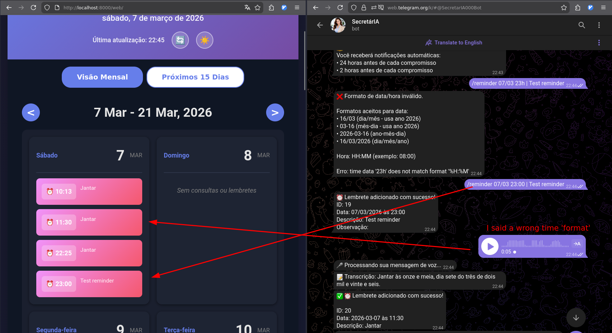

# Kalendario

A **multi-user event scheduler** with a Telegram bot for managing events and a static web app for viewing them on any device.



## 🌟 Key Features

✨ **Multi-User Support** - Each Telegram user has their own private events  
🔒 **User Whitelist** - Optional access control to restrict who can use the bot  
🔔 **Automatic Reminders** - Get notified 24h and 2h before each event  
🎤 **Voice Messages** - Add events by speaking (powered by OpenAI Whisper)  
🔁 **Recurring Events** - Schedule weekly, biweekly, monthly, or yearly series  
📱 **Telegram Bot** - Manage events from anywhere  
🖥️ **Web Dashboard** - Beautiful calendar view optimized for tablets  
🔄 **Auto-Sync** - Bot and web share the same data instantly  

## Project Structure

```
kalendario/
├── bot/                      # Telegram bot
│   ├── bot.py               # Bot implementation
│   ├── test_recurring.py    # Unit tests (45 tests)
│   └── requirements.txt     # Python dependencies
├── web/                      # Web application
│   ├── index.html           # Main HTML
│   ├── app.js               # JavaScript logic
│   └── styles.css           # Styling
└── data/                     # JSON data storage
    └── appointments.json    # Appointments database
```

## Features

### Web Application
- 📅 Interactive calendar view with event indicators
- 🔁 Recurring events expanded and shown in all views
- 📋 Events list scoped to the current viewed month
- ⏰ Today's reminders section
- 📱 Responsive design optimized for tablets
- 🔄 Auto-refresh every 2 minutes with cache-busting
- 🎨 Color-coded by type: events (green), reminders (pink/red), recurring (amber/purple)

### Telegram Bot
- ➕ Add events and reminders via text commands
- 🔁 Add recurring events via `/addrec` or voice message
- 🎤 Add events via voice messages (OpenAI Whisper)
- 📝 Flexible date input (accepts dates without year)
- 📋 List your own events (filtered by user)
- ❌ Delete events by ID; `/delrec` removes an entire recurring series
- 🔔 **Automatic reminder notifications** (24h and 2h before each occurrence)
- 👥 **Multi-user support** - each user has private events
- 🔒 **Optional whitelist** - restrict access to specific users
- 💾 Persistent JSON storage

## Setup Instructions

### 1. Telegram Bot Setup

1. Create a new bot with BotFather on Telegram:
   - Open Telegram and search for @BotFather
   - Send `/newbot` and follow the instructions
   - Save the bot token you receive

2. Install Python dependencies:
```bash
cd bot
pip install -r requirements.txt
```

3. Set your bot token:
```bash
export TELEGRAM_BOT_TOKEN="your_token_here"
```

4. Run the bot:
```bash
python bot.py
```

### 2. Web Application Setup

Start a local web server in the `web` directory:

```bash
# Python
cd web && python -m http.server 8000

# Node.js
cd web && npx http-server -p 8000
```

Open your browser or tablet to `http://localhost:8000`.  
On the same network, replace `localhost` with your machine's IP address.

### 3. Running with Docker

```bash
docker-compose up
```

### 4. Running Tests

```bash
cd bot
python3 -m pytest test_recurring.py -v
```

## Using the Telegram Bot

### Commands

| Command | Description |
|---|---|
| `/start` | Welcome message |
| `/add DATE TIME \| TITLE \| DESCRIPTION \| LOCATION` | Add a one-time event |
| `/addrec DATE TIME \| FREQ \| TITLE \| DESCRIPTION \| LOCATION` | Add a recurring event |
| `/list` | List your upcoming appointments |
| `/delete ID` | Delete a one-time appointment |
| `/delrec ID` | Delete an entire recurring series |

**Frequency values for `/addrec`:** `semanal`, `quinzenal`, `mensal`, `anual`  
(also accepted in English: `weekly`, `biweekly`, `monthly`, `yearly`)

### Example Usage

```
# One-time event
/add 2026-06-10 09:00 | Reunião de planejamento | Pauta Q3 | Sala 101

# Weekly recurring event
/addrec 2026-06-01 08:00 | semanal | Academia | Treino funcional | Parque

# List all (recurring series shown as single rule)
/list

# Remove the recurring series with ID 3
/delrec 3
```

**Voice messages** are also supported — just send a voice note describing the event (including frequency words like "toda semana" or "todo mês" for recurring events).

## JSON Data Format

Appointments are stored in `data/appointments.json`:

```json
{
  "appointments": [
    {
      "id": 1,
      "date": "2026-06-10",
      "time": "09:00",
      "doctor": "Reunião de planejamento",
      "description": "Pauta Q3",
      "location": "Sala 101",
      "type": "appointment",
      "created_at": "2026-05-11T10:00:00"
    },
    {
      "id": 2,
      "date": "2026-06-01",
      "time": "08:00",
      "doctor": "Academia",
      "description": "Treino funcional",
      "location": "Parque",
      "recurrence": "weekly",
      "type": "appointment",
      "created_at": "2026-05-11T10:05:00"
    }
  ]
}
```

Recurring entries store a single rule (one JSON object per series). The bot and web frontend both expand the rule into concrete occurrences on the fly. Reminders are tracked per-occurrence so no occurrence is notified twice.

> Note: the `doctor` field is a legacy name kept for backwards compatibility — it holds the event title.

## License

MIT License - Feel free to use and modify this project for your needs!
